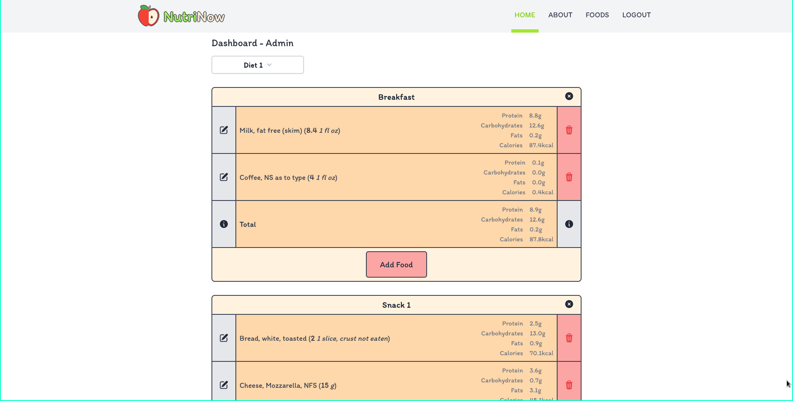

# NutriNow
Make the diet of your dreams

# Description

NutriNow is a website for meal planning.
It calculates your daily nutritional values based on the foods you pick,
allowing you to adapt accordingly.

# License
All files in this repository are licensed under the GNU Affero General Public License - Version 3.0 (GNU AGPLv3.0), with the exception of:

`frontend/src/assets/imgs/*`: Each file has its own license. Read the `frontend/src/assets/imgs/CREDITS` file for more information.

`frontend/src/assets/fonts/Itim/*`: Open Font License Version 1.1 (more information at: `frontend/src/assets/fonts/Itim/OFL.txt`)

For more information about the GNU AGPLv3.0, read the file `LICENSE` on the root directory of this repository.
